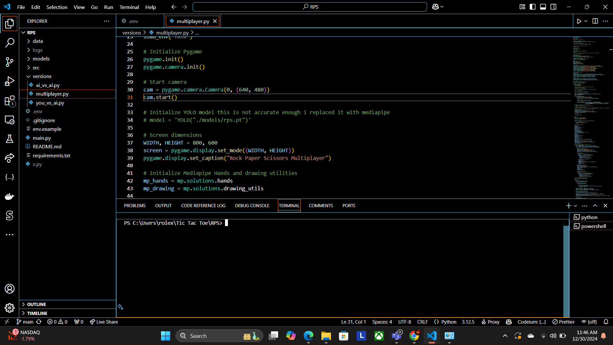
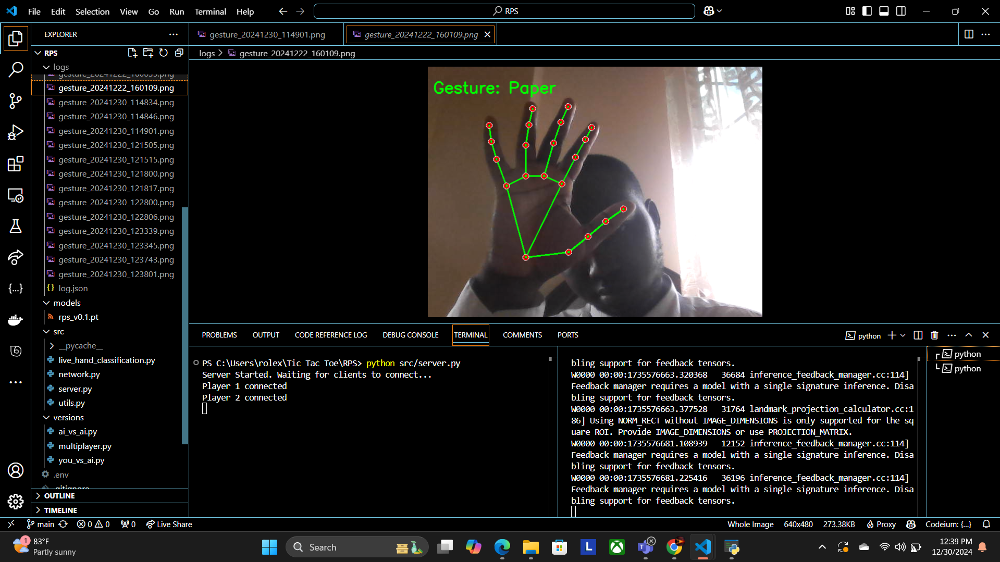
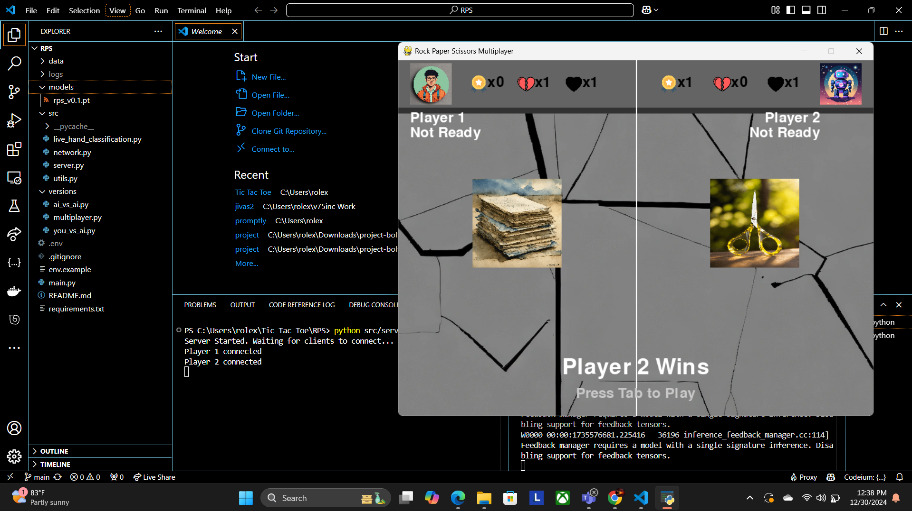
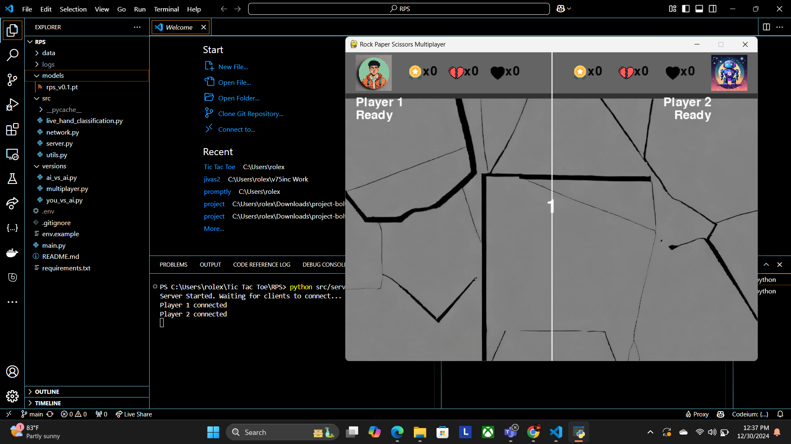
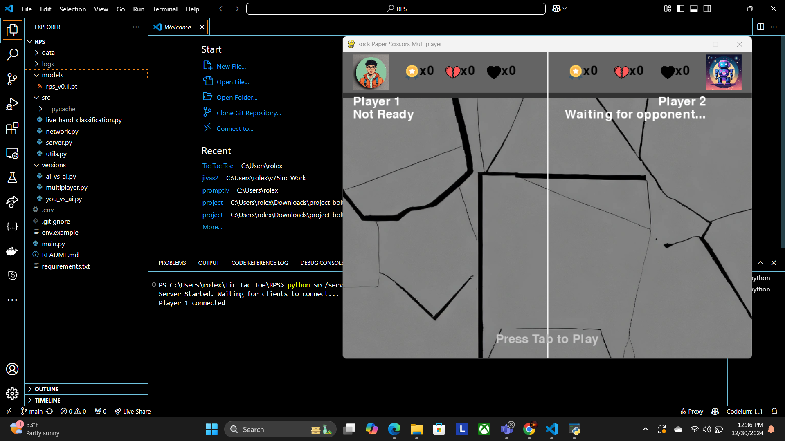
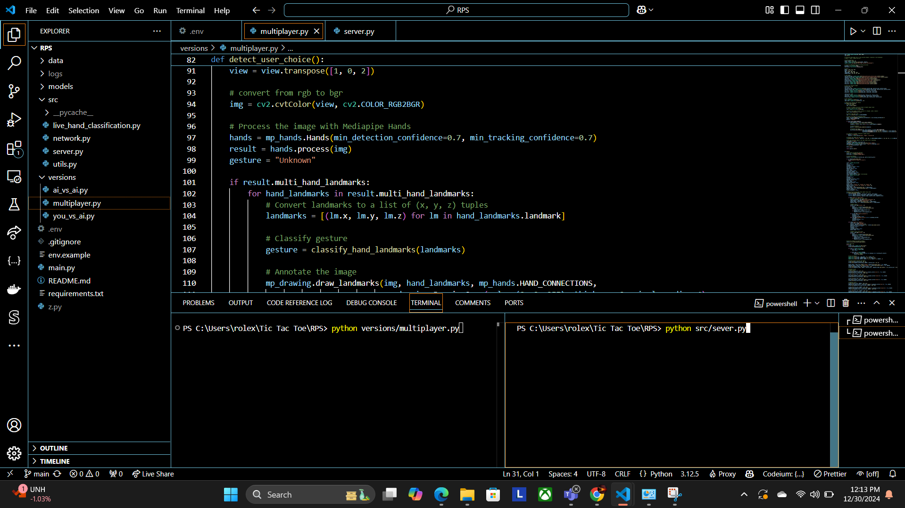

# Rock Paper Scissors Game

This is my final project for CKCS149 DCY - Python Programming - P2024.

I created a Pygame-based Rock Paper Scissors game that now utilizes Mediapipe hand detection, replacing the previous YOLOv8 model, for improved performance. Additionally, I developed several game modes, including a multiplayer version using sockets and an AI opponent powered by ChatGPT. My name is Rolex Antoine Alexander. Lecturer: Dr. Mihal Miu.

---

## How to Run the Game

### General Requirements
1. Ensure your environment has access to a camera and Python installed.
2. Install the required dependencies:
   ```bash
   pip install -r requirements.txt
   ```

### Setting Up Environment Variables
Copy the example environment file and replace its contents
```bash
cp env.example .env
```
Update the `.env` file with your values:
```env
GITHUB_TOKEN=your_github_token
SERVER_IP=270.1.0.0.1
SERVER_PORT=5555
```

### Running Different Versions

#### **You vs Random Computer (Main Game)**
To play against a randomly selecting computer:
```bash
python main.py
```

#### **You vs AI (ChatGPT)**
To play against the AI opponent:
```bash
python versions/you_vs_ai.py
```

Ensure your GitHub token is set in the environment (`.env`) to allow proper functionality.

#### **Multiplayer**
To play against another player:
1. Start the server:
   ```bash
   python src/server.py
   ```
2. Set your `.env` file with the following details:
   - `SERVER_PORT`: Port where the server is running.
   - `SERVER_IP`: IPv4 address of the server.
3. Run the multiplayer version:
   ```bash
   python versions/multiplayer.py
   ```
**Important:** Do not run two instances of `multiplayer.py` on the same system, as only one process can access the camera at a time.

#### **AI vs AI**
To watch two AI instances compete:
```bash
python versions/ai_vs_ai.py
```

---

## Game Overview

This game leverages your camera to detect hand gestures using Mediapipe. Depending on your gesture ("rock," "paper," or "scissors"), the game:
1. Matches your choice against a random computer, AI, or another player.
2. Displays the result (win, lose, or draw) with the current score.

### Key Features
- **Multiplayer Mode:** Play with a friend via a local server.
- **AI Opponent:** Challenge ChatGPT in a strategic 1v1 match.
- **AI vs AI Mode:** Watch two AI instances battle it out.

---

## Disclaimer

- The previous YOLOv8 model was replaced with Mediapipe for more accurate hand detection.
- For the multiplayer mode, ensure the server is correctly configured, and camera access is limited to one instance at a time.

---

## Game Files

- `main.py`: The classic "You vs Random Computer" game.
- `versions/you_vs_ai.py`: Play against ChatGPT.
- `versions/multiplayer.py`: Multiplayer mode using sockets.
- `versions/ai_vs_ai.py`: Watch two AI instances compete.
- `src/server.py`: Server for the multiplayer mode.

---

## Gameplay Logs

For `you_vs_ai.py` and `ai_vs_ai.py`, a JSON file (`log.json`) is generated in the `log` folder, detailing the reason behind the AI's move. Exploring the logs for the `ai_vs_ai.py` version will provide fascinating insights into the AI's decision-making process.

---

## Gameplay Photos
Below are screenshots of the game in action:
1. 
2. 
3. 
4. 
5. 
6. 

---

## Contributions
Feel free to contribute to the project by improving the gameplay or optimizing the code. Suggestions and feedback are welcome! Test out the various modes, especially playing against the AI, and see if you can beat ChatGPT in a 1v1 Rock Paper Scissors showdown.

---

## License
This project is open-source. Contribute and modify as needed!
